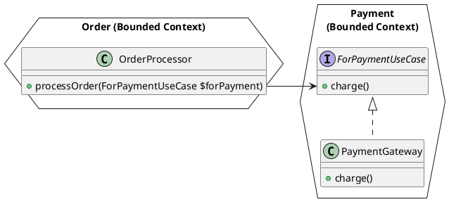

In [Part 1](/2025/06/27/enforcing-ports-and-adapters-in-php-with-deptrac/), we laid the foundation for a vertical architecture of our still muddy monolith. We are now able to enforce rules between PHP namespaces with deptrac.

But we can only enforce which namespaces talk to other namespaces; we don't have a defined way yet. Let's assume each namespace is a bounded context. Then other namespaces or bounded contexts should not simply be allowed to call every class of a bounded context, right? They should only be allowed to talk to the bounded context via a defined interface, or in Ports and Adapters speak, a driving port. 

Ports and Adapters defines the inside and the outside of a hexagon (in fact the hexagon is arbitrary here): The inside contains the business logic and rules, entities, events, and so on. The boundary is usually a Bounded Context. The outside of the hexagon is technical infrastructure.

The left side, the "driving side", is the inbound side—everything that talks to the hexagon. That could be your application's REST or GraphQL API, or in monoliths, other bounded contexts. The right side is the "driven" side—everything the hexagon needs to work, for example databases, APIs, or in a monolith, other bounded contexts.


### Step 1: Extract "driving" port interface in the `Payment` namespace

Let's do this with our `Payment` from the example in the first post. We don't want `PaymentGateway::charge()` to be called directly from outside the `Payment` namespace, but only via a defined interface. 

Let's call the interface `Payment\DrivingPort\ForPaymentUseCase` - which indicates it's for one specific use-case:



## Step 2: Adapt deptrac to enforce the rule

First, let's create a new `layer` in `deptrac.yaml` called `Payment_DrivingPorts`.

```
    - name: Payment_DrivingPorts
      collectors:
        - type: classLike
          value: DeptracPortsAdaptersSample\\Payment\\DrivingPort\\.*
```

Next, we have to adapt the existing `Payment` layer, so that it excludes the `Payment_DrivingPorts`, otherwise the definition would be ambiguous.

```
    - name: Payment
      collectors:
        - type: bool
          must:
            - type: classLike
              value: DeptracPortsAdaptersSample\\Payment\\.*
          must_not:
            - type: layer
              value: Payment_DrivingPorts
```

Finally, we need to adapt the "allowed layers", so that the `Order` layer (in our case: Bounded Context) is allowed to call the `Payment` layer/bounded context via its driving ports:

```
    Order:
      - Infrastructure
      - Payment_DrivingPorts # allow the Order domain to call Payment Ports
    Payment:
      - Payment_DrivingPorts # necessary to allow implementing the interface
```

Running deptrac will produce an error now (as we have not adapted the code yet):
```
 -------------------------- ---------------------------------------------------------------------------------------------------------------------- 
  Reason                     Order                                                                                                                 
 -------------------------- ---------------------------------------------------------------------------------------------------------------------- 
  DependsOnDisallowedLayer   DeptracPortsAdaptersSample\Order\OrderProcessor must not depend on DeptracPortsAdaptersSample\Payment\PaymentGateway  
                             You are depending on token that is a part of a layer that you are not allowed to depend on. (Payment)                 
                             /var/www/html/src/Order/OrderProcessor.php:10                                                                         
 -------------------------- ---------------------------------------------------------------------------------------------------------------------- 
```

## Step 3: Allowing existing violations, but no new ones

If you're trying to introduce this architecture into an existing piece of software, you will probably get a lot of violations at this step. But don't give up—Deptrac can generate a baseline file with known violations:

```
$ docker compose run --rm php vendor/bin/deptrac analyze --formatter=baseline

Baseline dumped to /var/www/html/deptrac.baseline.yaml
```

The generated baseline looks like this:

```
deptrac:
  skip_violations:
    DeptracPortsAdaptersSample\Order\OrderProcessor:
      - DeptracPortsAdaptersSample\Payment\PaymentGateway
```

We need to import the baseline into the `deptrac.yaml`:

```yaml
imports:
  - deptrac.baseline.yaml
```

The output looks like:

```
 -------------------- ----- 
  Report                    
 -------------------- ----- 
  Violations           0    
  Skipped violations   1    
  Uncovered            0    
  Allowed              3    
  Warnings             0    
  Errors               0    
 -------------------- ----- 
```

The advantage here is that existing violations are allowed and documented, but new violations will be detected (esp. when running deptrac as part of the CI workflow).

## Step 4: Adapt code to fit into the architectural style

But let's also fix our known violation now:

The driving port PHP interface looks straightforward
```php
namespace DeptracPortsAdaptersSample\Payment\DrivingPort;

interface ForPaymentUseCase
{
    public function charge(): void;
}
```

The calling code needs to be adapted, so that it uses the driving port interface:

```php
class OrderProcessor
{
    public function processOrder(ForPaymentUseCase $forPayment, Logger $logger): void
    {
        $forPayment->charge();
        $logger->log();
    }
}
```
Voilà, the calling code (`OrderProcessor`) is now decoupled from the inner workings of the `Payment` namespace.

(Note: The actual wiring is left out here, that's usually done by a DI container.)

Let's run deptrac again:

```
 ---------------------------------------------------------------------------------------------------------------------------------------------- 
  Errors                                                                                                                                        
 ---------------------------------------------------------------------------------------------------------------------------------------------- 
  Skipped violation "DeptracPortsAdaptersSample\Payment\PaymentGateway" for "DeptracPortsAdaptersSample\Order\OrderProcessor" was not matched.  
 ---------------------------------------------------------------------------------------------------------------------------------------------- 
```

Great! Deptrac complains that there is a skipped violation that does not exist (anymore, as we just fixed it). So let's generate a new baseline `deptrac analyze --formatter=baseline`. For this small example, it results in an empty baseline. In real-world projects we would have at least removed one violation and have made this software a little better (aka [the boyscout rule](https://deviq.com/principles/boy-scout-rule): We left the camping ground a bit cleaner than we found it.)
