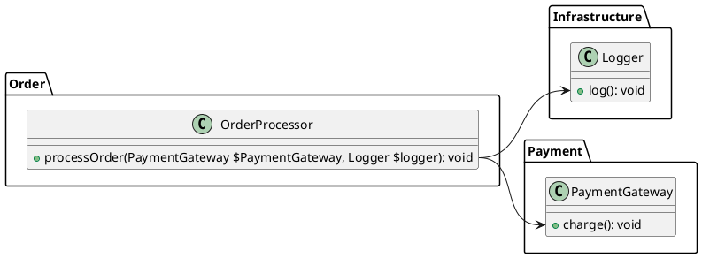

While Deptrac is commonly used to enforce horizontal boundaries within PHP projects, it can also help define and maintain vertical boundaries (such as [Bounded Contexts](https://martinfowler.com/bliki/BoundedContext.html) in DDD speak, or [Quanta](https://www.oreilly.com/library/view/building-evolutionary-architectures/9781491986356/ch04.html)) in PHP monoliths.

This capability is especially valuable when implementing the [Hexagonal aka. Ports and Adapters architecture](https://en.wikipedia.org/wiki/Hexagonal_architecture_(software)), ensuring clear separation of concerns and robust modularity in your PHP applications.

This three-part series will cover:

- Part 1: Setting up a basic Deptrac configuration for a PHP monolith (this post)
- Part 2: Refactoring spaghetti code into bounded contexts using Ports and Adapters
- Part 3: Enforcing architectural boundaries in your CI pipeline

<!--more-->

## Part 1: A basic deptrac configuration for a PHP monolith

A typical big ball of mud monolith still has some kind of structure, e.g. "packages" which are usually namespaced classes / directories containing similar classes, but referencing classes from other "packages" all over the place.

Let's assume the following directory structure:

```
Order/
    OrderProcessor.php
Infrastructure/
    Logger.php
Payment/
    PaymentGateway.php
Billing/
```
And the following files/classes:

### `src/Order/OrderProcessor.php`
```php
<?php

namespace DeptracPortsAdaptersSample\Order;

use DeptracPortsAdaptersSample\Infrastructure\Logger;
use DeptracPortsAdaptersSample\Payment\PaymentGateway;

class OrderProcessor
{
    public function processOrder(PaymentGateway $PaymentGateway, Logger $logger): void
    {
        $PaymentGateway->charge();
        $logger->log();
    }
}
```

### `src/Infrastructure/Logger.php`
```php
<?php

namespace DeptracPortsAdaptersSample\Infrastructure;

class Logger
{
    public function log(): void
    {
    }
}
```

### `src/Payment/PaymentGateway.php`
```php
<?php

namespace DeptracPortsAdaptersSample\Payment;

class PaymentGateway
{

    public function charge(): void
    {
    }
}
```
Here's a simple UML diagram to visualize the dependencies between these classes:


In this example we want to make sure that `Order` can only access `Infrastructure` and `Payment`, but not `Billing`. We can use deptrac to enforce this rule.

## Enforcing vertical boundaries with deptrac

First, we define the basic structure in `deptrac.yaml`:

```yaml
deptrac:
  paths:
    - ./src
  layers:
    - name: Infrastructure
      collectors:
        - type: classLike
          value: DeptracPortsAdaptersSample\\Infrastructure\\.*
    - name: Order
      collectors:
        - type: classLike
          value: DeptracPortsAdaptersSample\\Order\\.*
    - name: Payment
      collectors:
        - type: classLike
          value: DeptracPortsAdaptersSample\\Payment\\.*
    - name: Billing
      collectors:
        - type: classLike
          value: DeptracPortsAdaptersSample\\Billing\\.*
```

So each package becomes a 'layer' in deptrac. 
This is the key insight: while deptrac is typically used to define horizontal boundaries, we can also use it to define vertical boundaries by treating each package as a layer.

If we run deptrac, we already see two violations:

```
 -------------------------- ------------------------------------------------------------------------------------------------------------------ 
  Reason                     Order                                                                                                          
 -------------------------- ------------------------------------------------------------------------------------------------------------------ 
  DependsOnDisallowedLayer   DeptracPortsAdaptersSample\Order\OrderProcessor must not depend on DeptracPortsAdaptersSample\Payment\PaymentGateway  
                             You are depending on token that is a part of a layer that you are not allowed to depend on. (Payment)            
                             /var/www/html/src/Order/OrderProcessor.php:10                                                                      
  DependsOnDisallowedLayer   DeptracPortsAdaptersSample\Order\OrderProcessor must not depend on DeptracPortsAdaptersSample\Infrastructure\Logger          
                             You are depending on token that is a part of a layer that you are not allowed to depend on. (Infrastructure)                
                             /var/www/html/src/Order/OrderProcessor.php:10                                                                      
 -------------------------- ------------------------------------------------------------------------------------------------------------------ 


 -------------------- ----- 
  Report                    
 -------------------- ----- 
  Violations           2    
  Skipped violations   0    
  Uncovered            0    
  Allowed              0    
  Warnings             0    
  Errors               0    
 -------------------- ----- 
```

deptrac has detected that `Order` is depending on `Payment` and `Infrastructure`, which is currently not allowed, so let's adapt the config:

```yaml
deptrac:
  ...
  ruleset:
    Order:
      - Infrastructure
      - Payment
```

Now, if we run deptrac again, we see that the violations are gone:

```
 -------------------- ----- 
  Report                    
 -------------------- ----- 
  Violations           0    
  Skipped violations   0    
  Uncovered            0    
  Allowed              2    
  Warnings             0    
  Errors               0    
 -------------------- ----- 
```

Congratulations, you have successfully set up a basic deptrac configuration to enforce vertical architectural boundaries in your PHP monolith!

Usually, that's only the first step, since allowing to call all classes in `Infrastructure` and `Payment` from `Order` is not a good idea, as it will lead to a lot of dependencies between the packages.

It's better to define a clear API of what Order exposes to the outside world. In Ports & Adapters, this is usually done by defining a 'driven' port interface. That's what we will cover in the next part of this series.