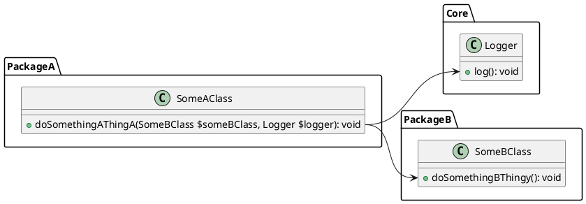

While Deptrac is commonly used to enforce horizontal boundaries within PHP projects, it can also help define and maintain vertical boundaries (such as bounded contexts in DDD speak, or [quanta](https://www.oreilly.com/library/view/building-evolutionary-architectures/9781491986356/ch04.html)) in PHP monoliths.
This capability is especially valuable when implementing the Ports and Adapters architecture, ensuring clear separation of concerns and robust modularity in your PHP applications.

This three-part series will cover:

- Part 1: Setting up a basic Deptrac configuration for a PHP monolith (this post)
- Part 2: Refactoring spaghetti code into bounded contexts using Ports and Adapters
- Part 3: Enforcing architectural boundaries in your CI pipeline

<!--more-->

## Part 1: A basic deptrac configuration for a PHP monolith

A typical big ball of mud monolith still has some kind of structure, e.g. "packages" which are usually namespaced classes / directories containing similar classes, but referencing classes from other "packages" all over the place.

Let's assume the following directory structure:

```
PackageA/
    SomeAClass.php
Core/
    Logger.php
PackageB/
    SomeBClass.php
PackageC/
```
And the following files/classes:

### `src/PackageA/SomeAClass.php`
```php
<?php

namespace DeptracPortsAdaptersSample\PackageA;

use DeptracPortsAdaptersSample\Core\Logger;
use DeptracPortsAdaptersSample\PackageB\SomeBClass;

class SomeAClass
{
    public function doSomethingAThingA(SomeBClass $someBClass, Logger $logger): void
    {
        $someBClass->doSomethingBThingy();
        $logger->log();
    }
}
```

### `src/Core/Logger.php`
```php
<?php

namespace DeptracPortsAdaptersSample\Core;

class Logger
{
    public function log(): void
    {
    }
}
```

### `src/PackageB/SomeBClass.php`
```php
<?php

namespace DeptracPortsAdaptersSample\PackageB;

class SomeBClass
{

    public function doSomethingBThingy(): void
    {
    }
}
```
Here's a simple UML diagram to visualize the dependencies between these classes:


In this example we want to make sure that `PackageA` can only access `Core` and `PackageB`, but not `PackageC`. We can use deptrac to enforce this rule.

## Enforcing vertical boundaries with deptrac

First, we define the basic structure in `deptrac.yaml`:

```yaml
deptrac:
  paths:
    - ./src
  layers:
    - name: Core
      collectors:
        - type: classLike
          value: DeptracPortsAdaptersSample\\Core\\.*
    - name: PackageA
      collectors:
        - type: classLike
          value: DeptracPortsAdaptersSample\\PackageA\\.*
    - name: PackageB
      collectors:
        - type: classLike
          value: DeptracPortsAdaptersSample\\PackageB\\.*
    - name: PackageC
      collectors:
        - type: classLike
          value: DeptracPortsAdaptersSample\\PackageC\\.*
```

So each package becomes a 'layer' in deptrac. 
This is the key insight: while deptrac is typically used to define horizontal boundaries, we can also use it to define vertical boundaries by treating each package as a layer.

If we run deptrac, we already see two violations:

```
 -------------------------- ------------------------------------------------------------------------------------------------------------------ 
  Reason                     PackageA                                                                                                          
 -------------------------- ------------------------------------------------------------------------------------------------------------------ 
  DependsOnDisallowedLayer   DeptracPortsAdaptersSample\PackageA\SomeAClass must not depend on DeptracPortsAdaptersSample\PackageB\SomeBClass  
                             You are depending on token that is a part of a layer that you are not allowed to depend on. (PackageB)            
                             /var/www/html/src/PackageA/SomeAClass.php:10                                                                      
  DependsOnDisallowedLayer   DeptracPortsAdaptersSample\PackageA\SomeAClass must not depend on DeptracPortsAdaptersSample\Core\Logger          
                             You are depending on token that is a part of a layer that you are not allowed to depend on. (Core)                
                             /var/www/html/src/PackageA/SomeAClass.php:10                                                                      
 -------------------------- ------------------------------------------------------------------------------------------------------------------ 


 -------------------- ----- 
  Report                    
 -------------------- ----- 
  Violations           2    
  Skipped violations   0    
  Uncovered            0    
  Allowed              0    
  Warnings             0    
  Errors               0    
 -------------------- ----- 
```

deptrac has detected that `PackageA` is depending on `PackageB` and `Core`, which is currently not allowed, so let's adapt the config:

```yaml
deptrac:
  ...
  ruleset:
    PackageA:
      - Core
      - PackageB
```

Now, if we run deptrac again, we see that the violations are gone:

```
 -------------------- ----- 
  Report                    
 -------------------- ----- 
  Violations           0    
  Skipped violations   0    
  Uncovered            0    
  Allowed              2    
  Warnings             0    
  Errors               0    
 -------------------- ----- 
```

Congratulations, you have successfully set up a basic deptrac configuration to enforce vertical architectural boundaries in your PHP monolith!

Usually, that's only the first step, since allowing to call all classes in `Core` and `PackageB` from `PackageA` is not a good idea, as it will lead to a lot of dependencies between the packages.

It's better to define a clear API of what PackageA exposes to the outside world. In Ports & Adapters, this is usually done by defining a 'driven' port interface. That's what we will cover in the next part of this series.