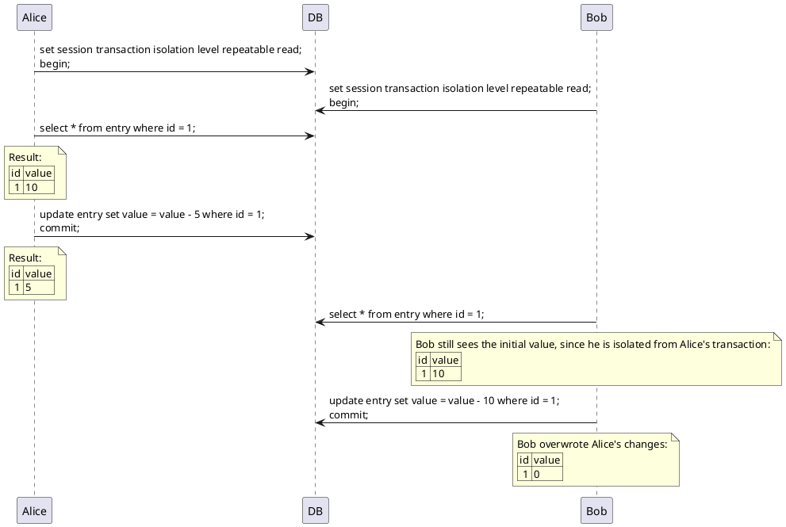
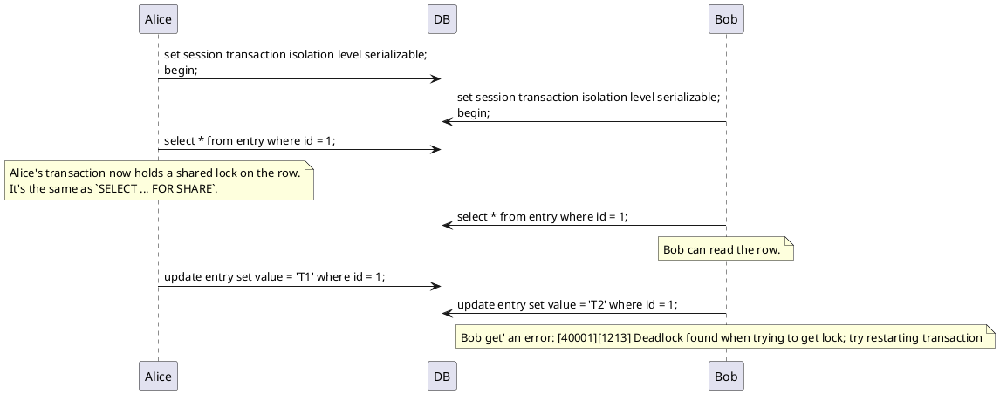
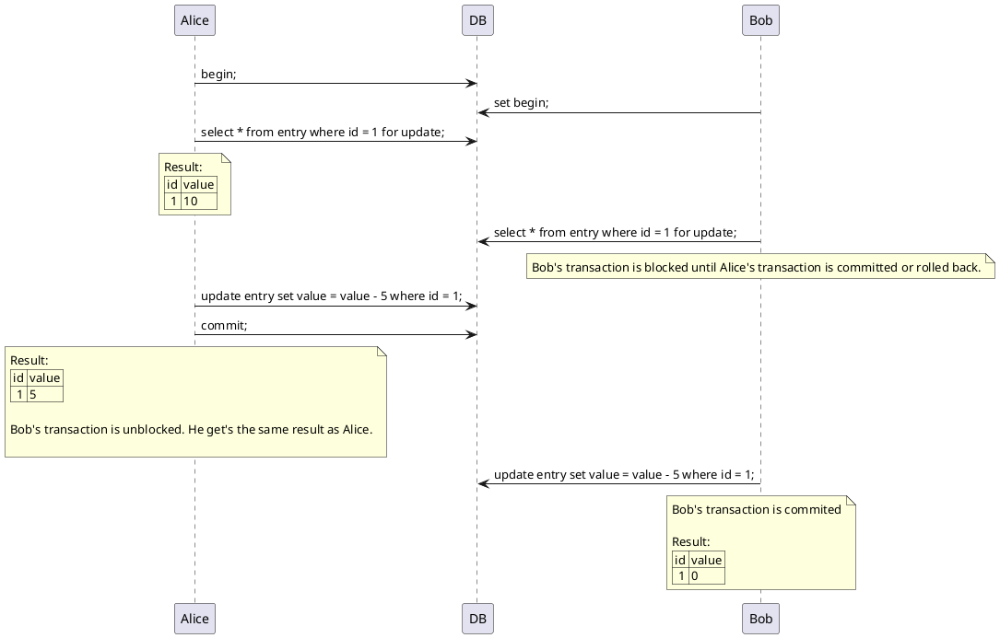
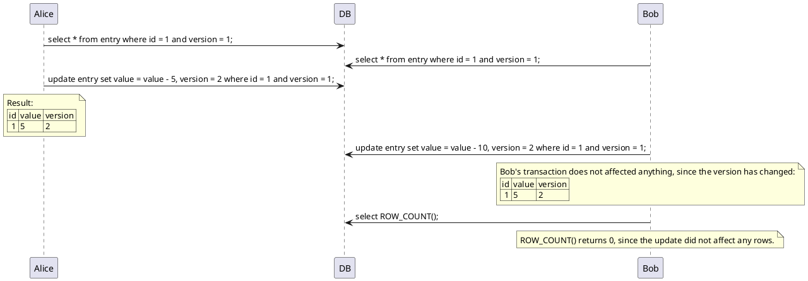
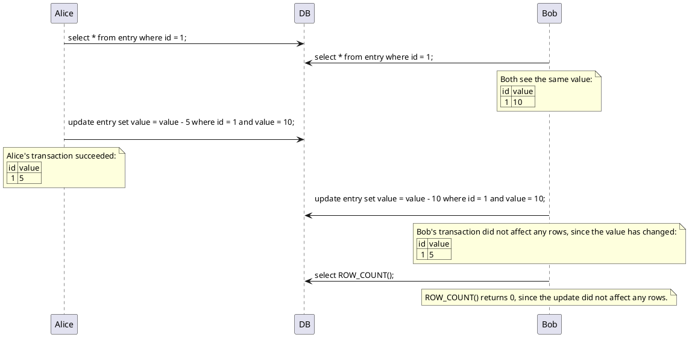

The **Lost Update Problem** is a common issue in concurrent systems, where two transactions read the same data, modify it, and write it back to the database. The second transaction will overwrite the changes made by the first transaction, causing the first transaction's changes to be lost.

This is especially problematic in cases where money in a bank account is involved, as it can lead to inconsistencies in the account balance. A rather dramatic example of this is the [Flexcoin bankruptcy](https://www.reuters.com/article/technology/bitcoin-bank-flexcoin-shuts-after-hacking-theft-idUSBREA2329B/). 

<!--more-->

For example, in MySQL the default isolation level is `REPEATABLE READ`, which means that a transaction will read the same data multiple times and get the same result. However, this does not prevent the Lost Update Problem, as shown in this sequence diagram:

Fortunately, there are several ways to solve the Lost Update Problem:

## Isolation Level `SERIALIZABLE` 
 
`SERIALIZABLE` is the strictest isolation level, which prevents the Lost Update Problem by bailing out transactions that would cause conflicts:

In MySQL, `SERIALIZABLE` is the same as `SELECT ... FOR SHARE`, which means reads are not blocked, but writes are. This can lead to deadlocks, as shown in the sequence diagram above.

## SELECT ... FOR UPDATE

`SELECT ... FOR UPDATE` is a way to lock rows for writing, which prevents other transactions from reading or writing the same rows. This is useful when you want to prevent the Lost Update Problem, but do not want to use the `SERIALIZABLE` isolation level:

## Optimistic Locking

This approach involves adding a version column to the table, which is incremented every time a row is updated. When a transaction updates a row, it checks whether the version has changed since it was read. If the version has changed, the transaction will fail and the changes will not be applied. This approach is useful when conflicts are rare, as it avoids the overhead of locking and blocking transactions:

As an alternative, you can use a `WHERE` clause with the old value, instead of a version column. This is useful when the table does not have a version column:

## Roll your own locking

If locking via the database is not enough for your use case, you can implement your own locking mechanism, e.g. with Redis or Memcached. 

## References

- [A beginner’s guide to database locking and the lost update phenomena](https://vladmihalcea.com/a-beginners-guide-to-database-locking-and-the-lost-update-phenomena/)
- [Isolation Levels in MySQL](https://dev.mysql.com/doc/refman/8.4/en/innodb-transaction-isolation-levels.html)
- [The race condition that led to Flexcoin bankruptcy](https://vladmihalcea.com/race-condition/)